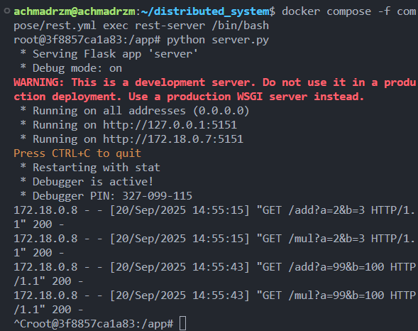
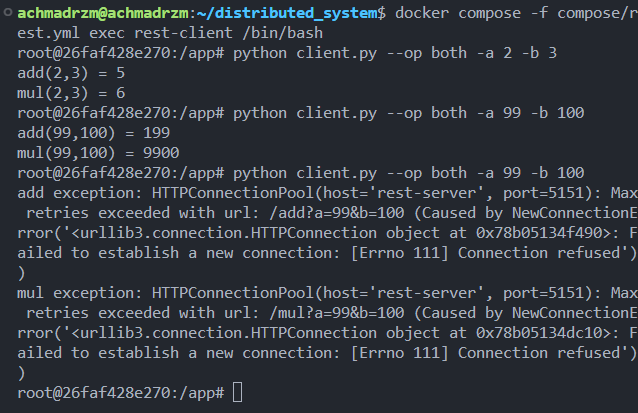
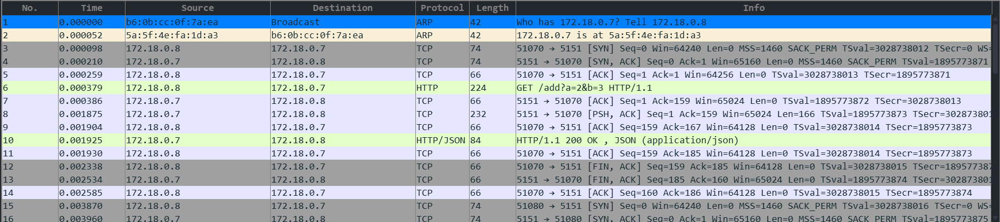
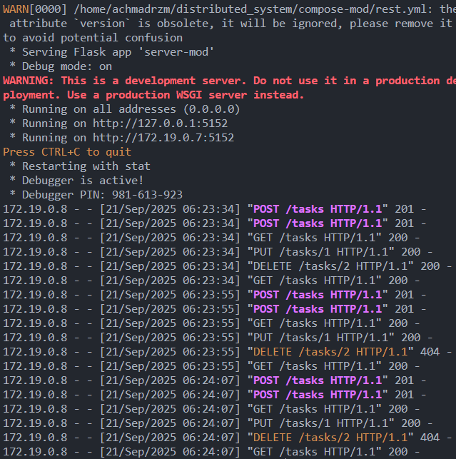
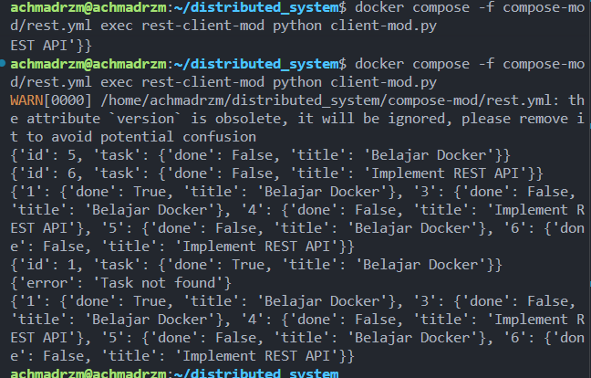

# Dokumentasi REST

## 1. Cara Kerja
REST (Representational State Transfer) bekerja dengan menggunakan protokol **HTTP**.  
Komunikasi dilakukan antara:
- **Client**: mengirimkan request ke server menggunakan HTTP method (GET, POST, PUT, DELETE, dll).
- **Server**: menerima request, memproses, lalu mengembalikan response dalam format tertentu (misalnya JSON).

Contoh alurnya:
1. Client mengirim request `GET http://localhost:5151/add?a=3&b=5`.
2. Server menerima request dan menjalankan penjumlahan.
3. Server mengembalikan response JSON:  
   ```json
   {"result": 8}

## 2. Contoh Output di Terminal

### Server (`server.py`)
  

### Client (`client.py`)



## 3. Analisis Wireshark



1. ARP (Address Resolution Protocol)
Frame 1–2:
172.18.0.8 (client) menanyakan siapa yang memiliki alamat IP 172.18.0.7.
172.18.0.7 (server) menjawab dengan alamat MAC-nya.

2. TCP Handshake
Frame 3: Client (172.18.0.8) → Server (172.18.0.7), SYN (mulai koneksi) pada port 5151.
Frame 4: Server → Client, SYN, ACK.
Frame 5: Client → Server, ACK (konfirmasi).

3. HTTP Request
Frame 6: Client mengirim HTTP GET ke server: GET /add?a=2&b=3 HTTP/1.1

4. HTTP Response
Frame 9: Server merespons dengan:
HTTP/1.1 200 OK
Content-Type: application/json
{"result": 5}

5. TCP Connection Termination
Frame 11–13: TCP FIN, ACK antara client dan server.

# Modifikasi REST




- Menambahkan CRUD sederhana untuk tasks: create, read, update, delete
- Server menyimpan tasks di memory dengan ID unik (next_id)
- Client bisa menambahkan, melihat, memperbarui, dan menghapus task melalui HTTP requests
- Input/output menggunakan JSON, server mengembalikan response yang jelas (task, id, error)