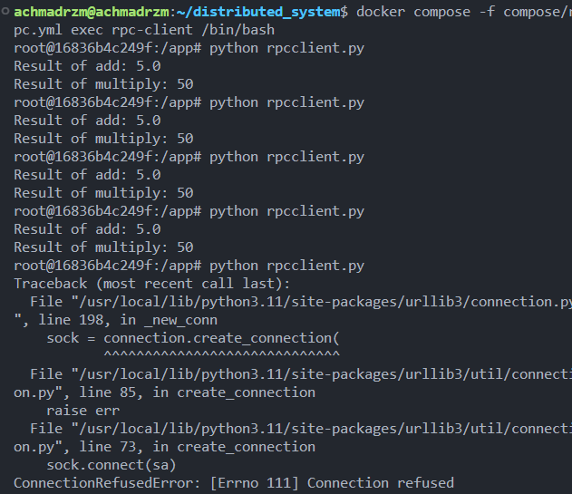
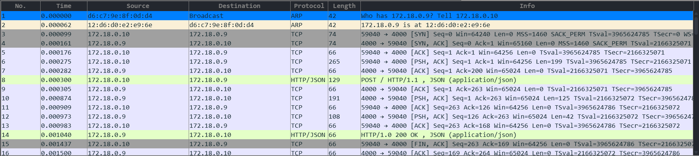

# Dokumentasi RPC (JSON-RPC)

## 1. Cara Kerja
RPC (Remote Procedure Call) memungkinkan **client** memanggil fungsi yang ada di **server** seolah-olah fungsi tersebut berjalan lokal.  
Dalam contoh ini digunakan **JSON-RPC** melalui protokol HTTP:

- **Server**: menyediakan metode/fungsi (`add`, `multiply`) yang dapat dipanggil oleh client.
- **Client**: mengirim request HTTP POST berformat JSON untuk memanggil fungsi di server.
- **JSON-RPC**: menentukan standar format request dan response.

Contoh alurnya:
1. Client mengirim request JSON:
   ```json
   {
     "jsonrpc": "2.0",
     "method": "add",
     "params": [10, 2],
     "id": 1
   }
   ```
2. Server menerima request, memanggil fungsi add(10, 2).
3. Server mengembalikan response JSON:
    ```json
   {
     "jsonrpc": "2.0",
     "id": 1,
     "result": 5
   }
   ```

## 2. Contoh Output di Terminal

### Server (`server.py`)
  

### Client (`client.py`)



## 3. Analisis Wireshark



1. ARP (Address Resolution Protocol)
Frame 1–2
172.18.0.10 menanyakan siapa yang memiliki IP 172.18.0.9.
172.18.0.9 menjawab dengan alamat MAC-nya.

2. TCP Handshake
Frame 3: Client (172.18.0.10:59040) → Server (172.18.0.9:4000), SYN.
Frame 4: Server → Client, SYN, ACK.
Frame 5: Client → Server, ACK.

3. HTTP Request (JSON-RPC Call)
Frame 8: Client mengirim HTTP POST ke / dengan body JSON berformat JSON-RPC.
{
  "jsonrpc": "2.0",
  "method": "add",
  "params": [10, 2],
  "id": 1
}

4. HTTP Response (JSON-RPC Result)
Frame 14: Server merespons dengan HTTP/1.1 200 OK dan body JSON:
{
  "jsonrpc": "2.0",
  "id": 1,
  "result": 5.0
}

5. TCP Connection Termination
Frame 15–16: Terjadi FIN, ACK antara client dan server.