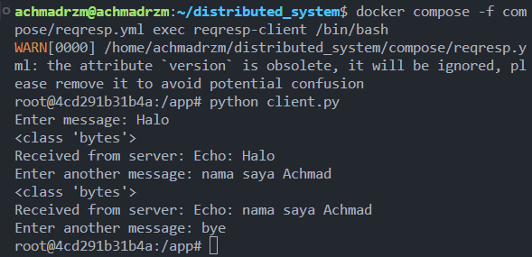

# Dokumentasi Req-Resp (TCP Socket)

## 1. Cara Kerja
Req-Resp (Request-Response) menggunakan model komunikasi **client-server** berbasis **TCP socket**:
- **Server**: menunggu koneksi dari client di sebuah port tertentu.
- **Client**: menghubungkan diri ke server, mengirim *request* berupa pesan.
- **Server**: menerima pesan, memproses, lalu mengirimkan *response* kembali ke client.

Contoh alurnya:
1. Client mengirim pesan `"Hello Server"` ke server melalui port `2222`.
2. Server menerima pesan tersebut.
3. Server membalas dengan `"Echo: Hello Server"`.

---

## 2. Contoh Program
Terdapat dua program:
- **server.py** → bertindak sebagai server, menerima pesan dari client, lalu membalas dengan prefix `"Echo:"`.
- **client.py** → bertindak sebagai client, mengirim pesan ke server, menunggu balasan, lalu menampilkannya di terminal.

---

## 3. Contoh Output di Terminal

 
### Server (`server.py`)
```bash
Server listening on 0.0.0.0:2222
Connection from: ('172.18.0.5', 45678)
Received from client: Hello Server
Received from client: Apa kabar?
Received from client: bye
```

  
### Client (`client.py`)
```bash
Enter message: Hello Server
Received from server: Echo: Hello Server

Enter another message: Apa kabar?
Received from server: Echo: Apa kabar?

Enter another message: bye
```

## 4. Analisis Wireshark


1. Ringkasan
Di dalamnya terlihat ada:
- Proses TCP handshake (SYN, SYN-ACK, ACK)
- ARP request/response (resolusi alamat MAC)
- Pengiriman data dari client ke server (PSH, ACK)
- Balasan data dari server ke client
- TCP connection termination (FIN, ACK)

2. Alur Komunikasi
a. TCP Handshake
- 172.18.0.3 → 172.18.0.2:2222 mengirim SYN
- 172.18.0.2 → 172.18.0.3 membalas SYN, ACK
- 172.18.0.3 → 172.18.0.2 mengirim ACK → koneksi TCP berhasil dibuka.

b. ARP Exchange
- Beberapa paket ARP terlihat (Who has ... Tell ...), untuk mencari alamat MAC dari masing-masing host.
- ARP memastikan IP 172.18.0.2 dan 172.18.0.3 bisa saling resolve ke alamat MAC sebelum komunikasi TCP lanjut.

c. Data Exchange (Request-Response)
- Client (172.18.0.3) mengirim pesan ke server dengan flag PSH, ACK.
- Server (172.18.0.2) membalas dengan ACK lalu mengirim data balasan.

d. Connection Termination
- 172.18.0.3 mengirim FIN, ACK → ingin menutup koneksi.
- 172.18.0.2 membalas dengan FIN, ACK → koneksi ditutup dengan rapi.