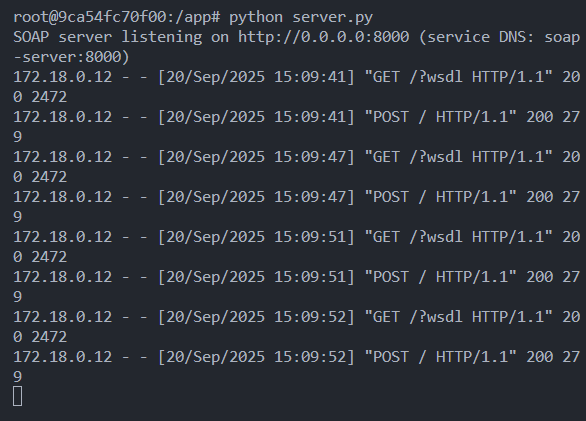
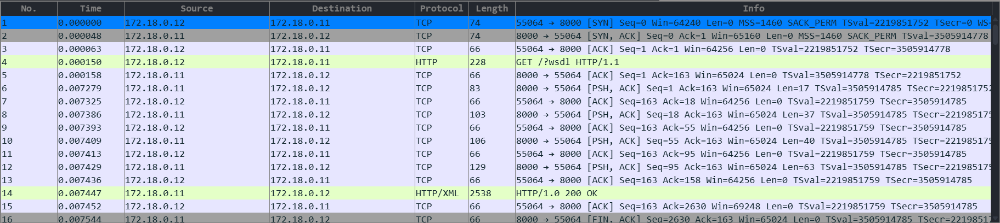

# Dokumentasi SOAP

## 1. Cara Kerja
SOAP (Simple Object Access Protocol) adalah protokol komunikasi berbasis **XML** yang berjalan di atas **HTTP** atau **SMTP**.  
SOAP menggunakan **WSDL (Web Services Description Language)**.

- **Server**: menyediakan layanan web (misalnya fungsi `add`) melalui SOAP.  
- **Client**: membaca WSDL, lalu memanggil layanan SOAP dengan request XML.  
- **SOAP Envelope**: request dan response dikemas dalam format XML standar.  

Contoh alurnya:
1. Client mengirim SOAP request berisi permintaan penjumlahan `10 + 5`:
   ```xml
   <soapenv:Envelope xmlns:soapenv="http://schemas.xmlsoap.org/soap/envelope/"
                     xmlns:tns="spyne.examples.calculator">
     <soapenv:Body>
       <tns:add>
         <a>10</a>
         <b>5</b>
       </tns:add>
     </soapenv:Body>
   </soapenv:Envelope>
    ```
2. Server menerima request dan mengeksekusi fungsi add(10, 5).
3. Server mengembalikan SOAP response:
    ```xml
    <soapenv:Envelope xmlns:soapenv="http://schemas.xmlsoap.org/soap/envelope/">
        <soapenv:Body>
            <tns:addResponse>
                <tns:addResult>15</tns:addResult>
            </tns:addResponse>
        </soapenv:Body>
    </soapenv:Envelope>
    ```

## 2. Contoh Output di Terminal

### Server (`server.py`)
  

### Client (`client.py`)


## 3. Analisis Wireshark

