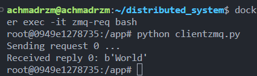
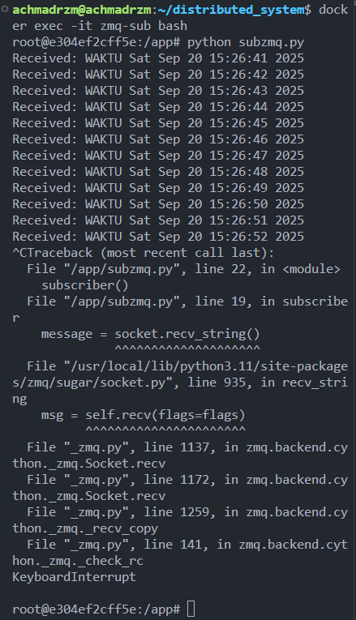
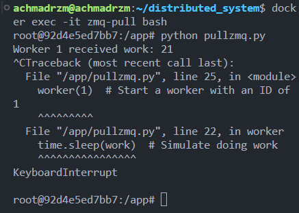

# Dokumentasi ZeroMQ (ZMQ)

## 1. Cara Kerja
ZeroMQ (ZMQ) adalah library messaging yang mendukung berbagai **pola komunikasi**.  
Tidak seperti RPC atau REST yang berbasis request-response HTTP, ZMQ menyediakan *socket* dengan beberapa pola komunikasi:  

- **REQ–REP**: Client mengirim request, server membalas (mirip RPC).
- **PUB–SUB**: Publisher mengirim pesan broadcast, subscriber menerima pesan sesuai *topic*.
- **PUSH–PULL**: Producer mendistribusikan pekerjaan ke banyak worker (load balancing).

Contoh dalam dokumentasi ini menggunakan tiga pola:
1. **REQ–REP**: Client (`clientzmq.py`) mengirim `"Hello"`, server (`serverzmq.py`) membalas `"World"`.
2. **PUB–SUB**: Publisher (`pubzmq.py`) broadcast pesan `"WAKTU ..."`, subscriber (`subzmq.py`) menerima.
3. **PUSH–PULL**: Producer (`pushzmq.py`) menghasilkan workload acak, beberapa worker (`pullzmq.py`) menerima dan memproses.

---

## 2. Contoh Output di Terminal

### REQ–REP
#### Client (`clientzmq.py`)

### PUB-SUB
#### Subscriber (`subzmq.py`)

### PUSH-PULL
#### Subscriber (`pullzmq.py`)

## 3. Konsep PUSH-PULL

### Konsep Push–Pull di ZMQ

PUSH (Producer)
Bertugas menghasilkan pekerjaan (workload), misalnya angka acak, data file, atau job lain.
Setiap workload akan dikirim ke salah satu worker yang tersedia.

PULL (Worker/Consumer)
Bertugas menerima pekerjaan dari producer, lalu memprosesnya.
Kalau ada banyak worker, pekerjaan akan dibagi rata secara otomatis (round-robin).

### Contoh Alur

- Misalnya ada 1 producer (push.py) dan 3 worker (pull.py):
- Producer menghasilkan workload (misalnya angka acak 42, 17, 33).
- Producer mengirim workload itu ke socket PUSH.
- ZMQ akan otomatis membagi:
-- Worker 1 → dapat 42
-- Worker 2 → dapat 17
-- Worker 3 → dapat 33
Masing-masing worker akan memproses workload yang diterimanya.